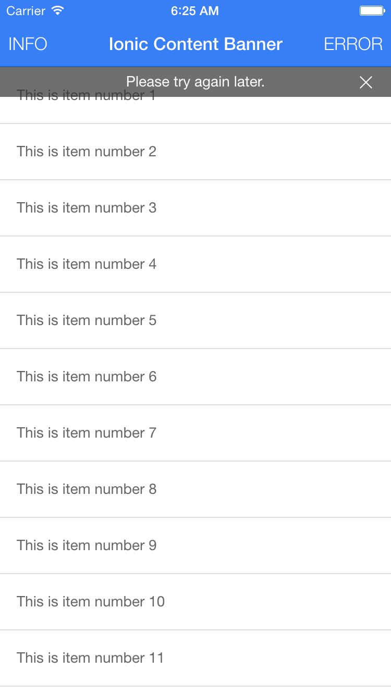
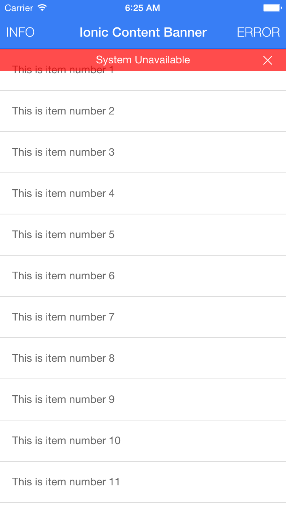
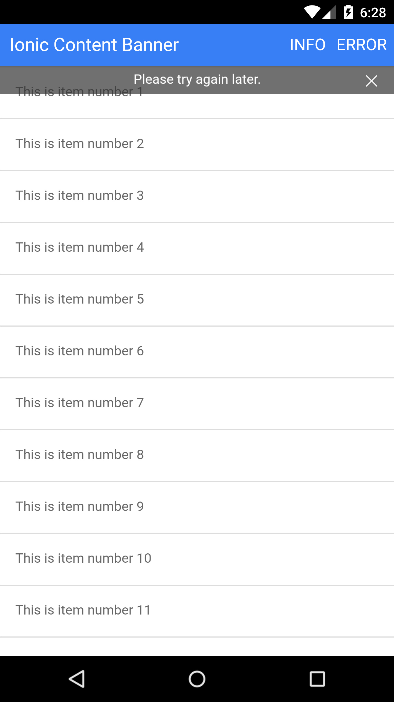
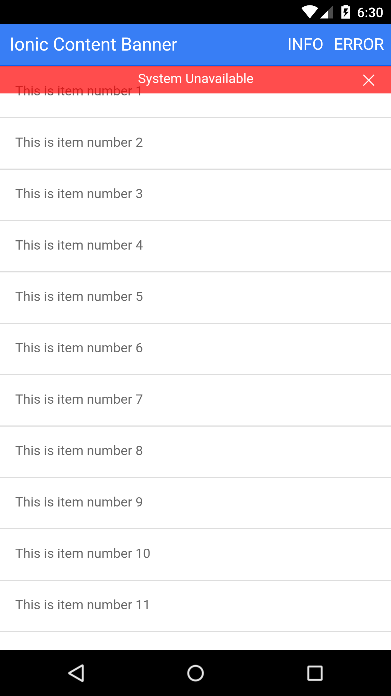

#Ionic Content Banner
>A Facebook style info/error content banner for the Ionic Framework

## Table of Contents
 - [Demo](#demo)
 - [Setup](#setup)
 - [Usage](#usage)
 - [Screenshots](#screenshots)

## Demo App

- Download from [Ionic View](http://view.ionic.io/) with appId: `5445a4a4`

View the demo application code at demo/ for an example on how to use the content banner.  To run the demo
clone the ionic-content-banner repo, then navigate to the demo/ directory and run the following

    npm install
    bower install
    gulp
    
## Setup

#### Install

`bower install ionic-content-banner`

#### JS/CSS Imports (index.html)
Include the following JavaScript/CSS file imports in your index.html.  Remember to import the ionic libraries first!
The example below assumes your 3rd party bower dependencies are located in the default bower_components folder.
    
    <link rel="stylesheet" href="bower_components/ionic-content-banner/dist/ionic.content.banner.css">
    

#### Angular Dependency (app.js)
Add `jett.ionic.content.banner` as a module dependency of your app module.

    angular.module('Demo', ['ionic', 'jett.ionic.content.banner'])
      .config(function () {..});

#### SASS Import (main.scss)

Include the `scss/ionic.content.banner.scss` file at the top of your `main.scss` file as shown below. Import any
custom Content Banner scss styles below the ionic and ionic.content.banner scss.

    @import
      "path_to_bower_components/ionic/scss/ionic",
      "path_to_bower_components/ionic-content-banner/scss/ionic.content.banner";

## Usage

### $ionicContentBanner

A service you can inject in your controller to show the Content Banner

#### $ionicContentBanner.show

  Create and show a new Content Banner.  A new isolated scope will be created for the Content Banner and the new
  Content Banner will animate just under the top of the active views ion-content.

  @returns {function} `close` A function which, when called, closes the Content Banner.  Make sure you use this to
  clean up and remove the content banner!!

  @param {object} options The options for the content banner. Properties:

  - `{string=}` `icon`

    The icon used for the close button.  defaults to `ion-ios-close-empty`

  - `{string=}` `transition`

    The transition used to animate in the content banner.  Supported options are `vertical` and `fade`; defaults to
    `vertical`.  The content banner will create a css class `content-banner-transition-{transitionVal}`, so you can add
    a custom value and then a custom css class to match if you would like to create your own transition.

  - `{string=}` `type`

    The type of banner to show.  Supported types are `info` and `error`; defaults to `info`. The content banner will
    create a css class `content-banner-{typeVal}`, so you can add a custom type value and then a custom css class to
    match if you would like to create your own type.

  - `[String]` `text`

    A string array that contains the text values to display on the banner.  If the array contains more than one value,
    the content banner will cycle through the values of the array at the supplied `interval` (see below).

  - `{number=}` `interval`

    Number of milliseconds between text value changes.  Default value is 7000ms (7 seconds).

  - `{boolean=}` `cancelOnStateChange`

    Whether to cancel the content banner when navigating to a new state.  Default value is true.

## Screenshots

